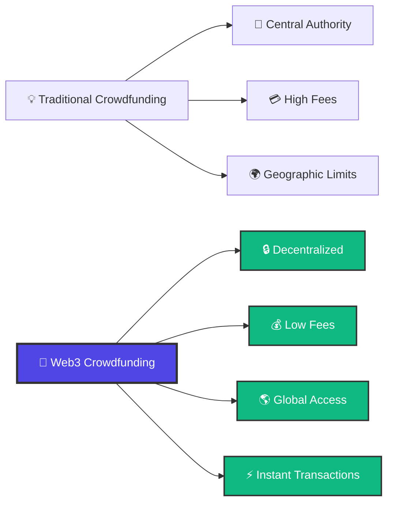

# 🌟 Web3 Crowdfunding Platform

<div align="center">

**A next-generation decentralized crowdfunding platform built on blockchain technology**

[](https://reactjs.org/)
[](https://vitejs.dev/)
[](https://soliditylang.org/)
[](https://thirdweb.com/)
[](https://ethereum.org/)

[🚀 Live Demo](#-live-demo) • [📖 Documentation](#-documentation) • [🛠️ Installation](#️-quick-start) • [🤝 Contributing](#-contributing)

</div>

---

## 📋 Table of Contents

- [✨ Features](#-features)
- [🎯 What Makes This Special](#-what-makes-this-special)
- [🏗️ Tech Stack](#️-tech-stack)
- [🚀 Quick Start](#-quick-start)
- [📁 Project Structure](#-project-structure)
- [🔧 Configuration](#-configuration)
- [📱 Usage Guide](#-usage-guide)
- [🛠️ Development](#️-development)
- [🚀 Deployment](#-deployment)
- [🔍 Testing](#-testing)
- [🤝 Contributing](#-contributing)
- [📄 License](#-license)

---

## ✨ Features

<div align="center">

### 🎪 **Core Functionality**

</div>

| Feature | Description | Status |
|---------|-------------|--------|
| 🎯 **Campaign Creation** | Create detailed fundraising campaigns with goals, deadlines, and descriptions | ✅ |
| 💰 **Crypto Donations** | Accept donations in ETH and other cryptocurrencies | ✅ |
| 👛 **Wallet Integration** | Seamless MetaMask and other wallet connections | ✅ |
| 📊 **Real-time Tracking** | Live progress tracking with beautiful visualizations | ✅ |
| 🔒 **Smart Contracts** | Secure, audited smart contracts on Ethereum | ✅ |
| 📱 **Responsive Design** | Perfect experience on desktop, tablet, and mobile | ✅ |
| 🌐 **Decentralized** | No central authority, truly peer-to-peer fundraising | ✅ |
| ⚡ **Lightning Fast** | Built with Vite for optimal performance | ✅ |

---

## 🎯 What Makes This Special

<div align="center">

### 🔥 **Revolutionary Features**

</div>



### 🌟 **Key Advantages**

- **🔐 Trustless**: Smart contracts eliminate the need for intermediaries
- **🌍 Global Reach**: Anyone, anywhere can participate
- **💸 Lower Fees**: Blockchain transactions cost fraction of traditional methods
- **🔍 Transparent**: All transactions are publicly verifiable
- **⚡ Fast**: Instant donations with blockchain speed
- **🛡️ Secure**: Military-grade cryptographic security

---

## 🏗️ Tech Stack

<div align="center">

### 🎨 **Frontend**


### ⛓️ **Blockchain**


### 🔧 **Tools & Services**


</div>

---

## 🚀 Quick Start

### 📋 Prerequisites

Before you begin, ensure you have the following installed:

- **Node.js** (v16.0 or higher) - [Download here](https://nodejs.org/)
- **npm** or **yarn** package manager
- **Git** - [Download here](https://git-scm.com/)
- **MetaMask** browser extension - [Install here](https://metamask.io/)

### ⚡ Installation

1. **Clone the repository**
   ```bash
   git clone https://github.com/03Karan30/web3-CrowdFunding.git
   cd web3-CrowdFunding
   ```

2. **Install Frontend Dependencies**
   ```bash
   cd client
   npm install
   ```

3. **Install Backend Dependencies**
   ```bash
   cd ../web3
   npm install
   ```

4. **Environment Setup**
   
   Create `client/.env`:
   ```env
   VITE_THIRDWEB_CLIENT_ID=your_thirdweb_client_id
   VITE_CONTRACT_ADDRESS=your_deployed_contract_address
   VITE_CHAIN_ID=11155111
   ```
   
   Create `web3/.env`:
   ```env
   PRIVATE_KEY=your_wallet_private_key
   SEPOLIA_RPC_URL=https://sepolia.infura.io/v3/your_infura_key
   ```

5. **Start Development Server**
   ```bash
   cd client
   npm run dev
   ```

🎉 **That's it!** Open `http://localhost:5173` in your browser.

#### 🔑 Getting Required Keys

<details>
<summary><b>🔸 ThirdWeb Client ID</b></summary>

1. Visit [ThirdWeb Dashboard](https://thirdweb.com/dashboard)
2. Create an account or sign in
3. Create a new project
4. Copy your Client ID from the dashboard

</details>

<details>
<summary><b>🔸 Infura RPC URL</b></summary>

1. Sign up at [Infura.io](https://infura.io)
2. Create a new project
3. Select Ethereum network
4. Copy the Sepolia endpoint URL

</details>

<details>
<summary><b>🔸 Sepolia Test ETH</b></summary>

1. Visit [Sepolia Faucet](https://sepoliafaucet.com/)
2. Enter your wallet address
3. Get free test ETH for transactions

</details>

---

## 📁 Project Structure

```
web3-CrowdFunding/
├── 📂 client/                    # React Frontend Application
│   ├── 📂 src/
│   │   ├── 📂 components/        # Reusable UI components
│   │   ├── 📂 pages/            # Application pages
│   │   ├── 📂 context/          # React context providers
│   │   ├── 📂 utils/            # Utility functions
│   │   ├── 📂 constants/        # App constants
│   │   ├── 📂 assets/           # Images, icons, etc.
│   │   └── 📄 main.tsx          # Application entry point
│   ├── 📂 public/               # Static assets
│   ├── 📄 package.json          # Frontend dependencies
│   ├── 📄 vite.config.js        # Vite configuration
│   └── 📄 .env                  # Frontend environment variables
├── 📂 web3/                     # Smart Contracts & Blockchain
│   ├── 📂 contracts/            # Solidity smart contracts
│   ├── 📂 scripts/              # Deployment scripts
│   ├── 📂 test/                 # Contract tests
│   ├── 📄 hardhat.config.js     # Hardhat configuration
│   ├── 📄 package.json          # Backend dependencies
│   └── 📄 .env                  # Blockchain environment variables
├── 📄 README.md                 # Project documentation
└── 📄 .gitignore               # Git ignore rules
```

---

## 🔧 Configuration

### 🎨 Frontend Configuration

The frontend is built with **React + TypeScript + Vite** for maximum performance and developer experience.

**Key Configuration Files:**

- `vite.config.js` - Vite bundler settings
- `tailwind.config.js` - TailwindCSS styling
- `tsconfig.json` - TypeScript configuration

### ⛓️ Blockchain Configuration

Smart contracts are deployed on **Sepolia Testnet** using **Hardhat**.

**Key Configuration Files:**

- `hardhat.config.js` - Network and deployment settings
- `contracts/CrowdFunding.sol` - Main smart contract
- `scripts/deploy.js` - Deployment automation

---

## 📱 Usage Guide

### 🚀 For Users

1. **Connect Wallet**
   - Click "Connect Wallet" button
   - Select MetaMask or preferred wallet
   - Approve connection

2. **Browse Campaigns**
   - View all active campaigns
   - Filter by category or funding goal
   - Read campaign details

3. **Make Donations**
   - Select campaign to support
   - Enter donation amount in ETH
   - Confirm transaction in wallet
   - Receive donation confirmation

4. **Create Campaign**
   - Click "Create Campaign"
   - Fill in campaign details
   - Set funding goal and deadline
   - Deploy campaign to blockchain
   - Share with potential donors

### 🛠️ For Developers

1. **Smart Contract Development**
   ```bash
   cd web3
   npx hardhat compile    # Compile contracts
   npx hardhat test       # Run tests
   npx hardhat run scripts/deploy.js --network sepolia  # Deploy
   ```

2. **Frontend Development**
   ```bash
   cd client
   npm run dev           # Start dev server
   npm run build         # Build for production
   npm run preview       # Preview production build
   ```

---

## 🛠️ Development

### 🔄 Available Scripts

#### Frontend Commands
```bash
cd client
npm run dev          # Start development server
npm run build        # Build for production
npm run preview      # Preview production build
npm run lint         # Run ESLint
npm run type-check   # Run TypeScript checks
```

#### Blockchain Commands
```bash
cd web3
npx hardhat compile        # Compile smart contracts
npx hardhat test          # Run contract tests
npx hardhat node         # Start local blockchain
npx hardhat clean        # Clean artifacts
```

### 🎨 Customization

<details>
<summary><b>🎭 Theming & Styling</b></summary>

The project uses **TailwindCSS** for styling. Customize the theme in `tailwind.config.js`:

```javascript
module.exports = {
  theme: {
    extend: {
      colors: {
        primary: '#4F46E5',
        secondary: '#7C3AED',
        // Add your custom colors
      }
    }
  }
}
```

</details>

<details>
<summary><b>⚙️ Smart Contract Modification</b></summary>

Main contract is located at `web3/contracts/CrowdFunding.sol`. After modifications:

```bash
npx hardhat compile
npx hardhat test
npx hardhat run scripts/deploy.js --network sepolia
```

</details>

---

## 🚀 Deployment

### 🌐 Frontend Deployment

#### Vercel (Recommended)
```bash
# Install Vercel CLI
npm i -g vercel

# Deploy
cd client
vercel --prod
```

#### Netlify
```bash
# Build the project
cd client
npm run build

# Upload 'dist' folder to Netlify
```

### ⛓️ Smart Contract Deployment

#### Sepolia Testnet
```bash
cd web3
npx hardhat run scripts/deploy.js --network sepolia
```

#### Mainnet (Production)
```bash
# Update hardhat.config.js with mainnet settings
npx hardhat run scripts/deploy.js --network mainnet
```

---

## 🔍 Testing

### 🧪 Smart Contract Tests

```bash
cd web3
npx hardhat test
```

Example test output:
```
✓ Should deploy contract correctly
✓ Should create campaign
✓ Should accept donations
✓ Should withdraw funds when goal reached
✓ Should refund when campaign fails
```

### 🔍 Frontend Testing

```bash
cd client
npm run test        # Run unit tests
npm run test:e2e    # Run end-to-end tests
```

---

## 🤝 Contributing

We welcome contributions from the community! Here's how you can help:

### 🎯 Ways to Contribute

- 🐛 **Bug Reports** - Found a bug? Open an issue!
- 💡 **Feature Requests** - Have ideas? We'd love to hear them!
- 📝 **Documentation** - Help improve our docs
- 🔧 **Code Contributions** - Submit pull requests
- 🎨 **Design** - Improve UI/UX
- 🧪 **Testing** - Write tests and find edge cases

### 📋 Contribution Guidelines

1. **Fork the repository**
2. **Create a feature branch**
   ```bash
   git checkout -b feature/amazing-feature
   ```
3. **Make your changes**
4. **Add tests** (if applicable)
5. **Commit with clear messages**
   ```bash
   git commit -m "Add amazing feature"
   ```
6. **Push to your branch**
   ```bash
   git push origin feature/amazing-feature
   ```
7. **Open a Pull Request**

### 🏆 Contributors

Thanks to all the amazing contributors who have helped make this project better!

<div align="center">

[](https://github.com/03Karan30/web3-CrowdFunding/graphs/contributors)

</div>

---

## 🔧 Troubleshooting

<details>
<summary><b>❌ Common Issues & Solutions</b></summary>

### Build Errors
```bash
# Clear cache and reinstall
rm -rf node_modules package-lock.json
npm install
```

### MetaMask Connection Issues
- Ensure you're on Sepolia testnet
- Check contract address in `.env`
- Verify you have test ETH

### Deployment Failures
- Check private key in `web3/.env`
- Verify RPC URL is working
- Ensure wallet has sufficient ETH

### Transaction Failures
- Increase gas limit
- Check network congestion
- Verify contract is deployed correctly

</details>

---

## 📊 Roadmap

### 🎯 Current Version (v1.0)
- ✅ Basic crowdfunding functionality
- ✅ MetaMask integration
- ✅ Campaign creation and donation
- ✅ Responsive design

### 🚀 Upcoming Features (v2.0)
- 🔄 Multi-token support (ERC-20)
- 📊 Advanced analytics dashboard
- 🔔 Real-time notifications
- 🌍 Multi-language support
- 📱 Mobile app (React Native)

### 🌟 Future Vision (v3.0)
- 🤖 AI-powered campaign recommendations
- 🏆 Gamification and rewards
- 🔗 Cross-chain compatibility
- 🎥 Video campaign pitches
- 📈 Investment tracking tools

---

## 📄 License

This project is licensed under the **MIT License** - see the [LICENSE](LICENSE) file for details.

```
MIT License

Copyright (c) 2024 Web3 Crowdfunding Platform

Permission is hereby granted, free of charge, to any person obtaining a copy
of this software and associated documentation files (the "Software"), to deal
in the Software without restriction, including without limitation the rights
to use, copy, modify, merge, publish, distribute, sublicense, and/or sell
copies of the Software, and to permit persons to whom the Software is
furnished to do so, subject to the following conditions:

The above copyright notice and this permission notice shall be included in all
copies or substantial portions of the Software.
```

---

<div align="center">

## 🌟 Show Your Support

If this project helped you, please consider giving it a ⭐ on GitHub!

### 📞 Connect With Us

[](https://twitter.com)
[](https://linkedin.com)
[](https://discord.gg)

### 💝 Support the Project

If you find this project valuable, consider supporting its development:

[](https://buymeacoffee.com)
[](https://ethereum.org/)

**ETH Address:** `0x1234567890123456789012345678901234567890`

---

**Made with ❤️ by developers, for developers**

*Empowering the future of decentralized fundraising*

</div>
